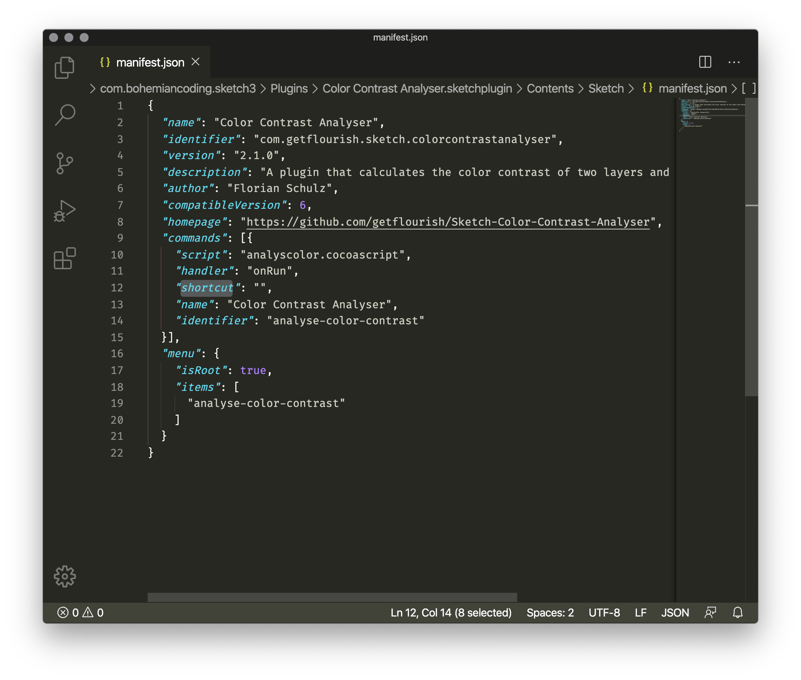
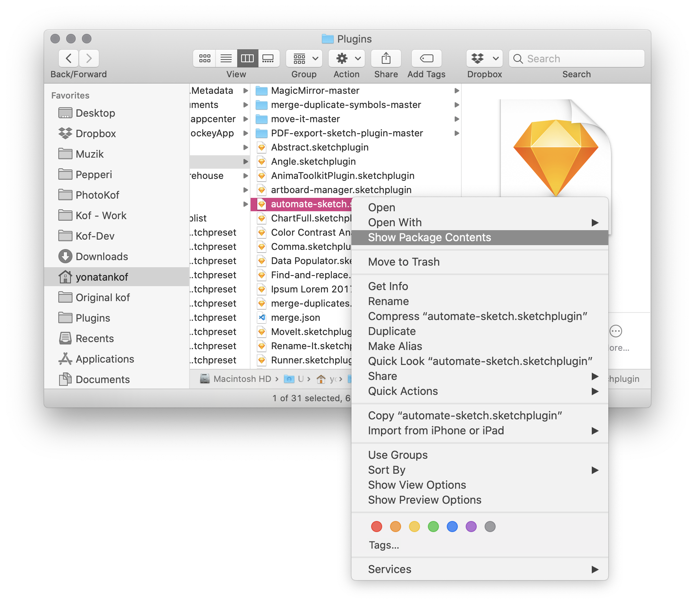
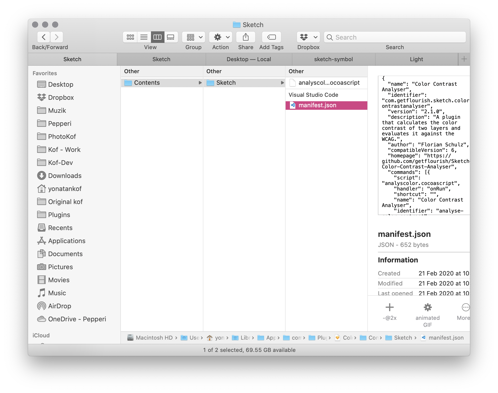
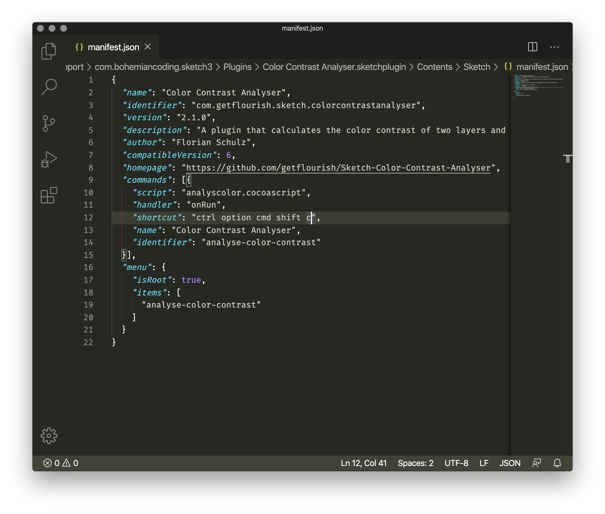
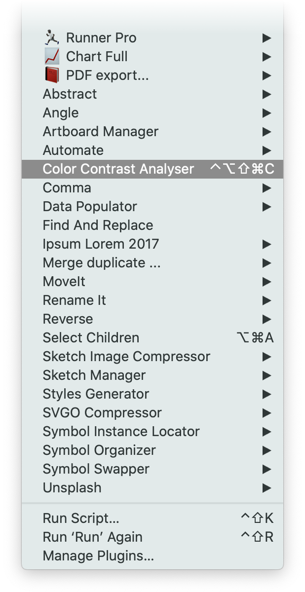
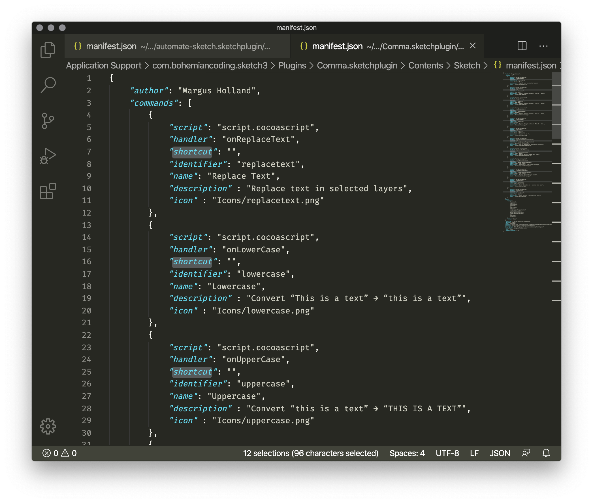
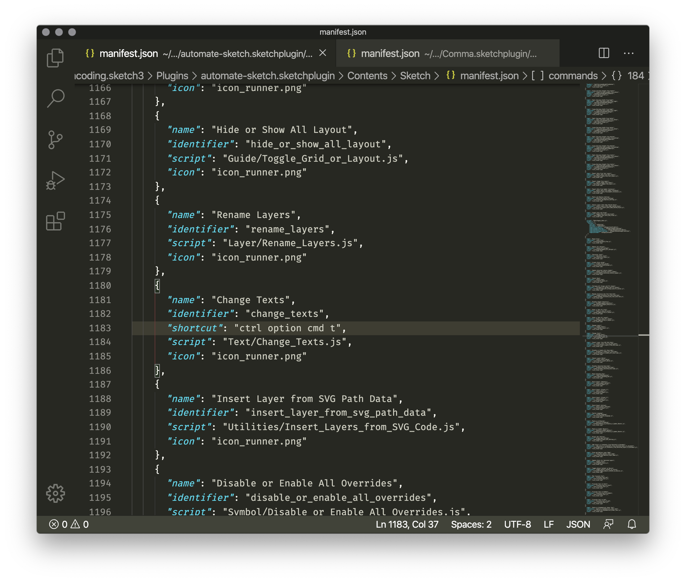

<!-- **Create edit, or remove shortcuts for a Sketch plugin.**

---

- [The solution](#the-solution)
  - [Find the plugin](#find-the-plugin)
  - [Edit the plugin](#edit-the-plugin)
  - [Edit the `manifest.js` file](#edit-the-manifestjs-file)
- [Good to know](#good-to-know)
  - [Modifier Keys](#modifier-keys)
  - [Duplicated shortcuts](#duplicated-shortcuts)
  - [Edit a shortcut](#edit-a-shortcut)
  - [Remove a shortcut](#remove-a-shortcut)
  - [No shortcut key/value pair?](#no-shortcut-keyvalue-pair)
- [Take aways](#take-aways)

--- -->

### The painful movment of a mouse

The [Color Contrast Analyser for Sketch](https://github.com/getflourish/Sketch-Color-Contrast-Analyser) is a useful plugin if you'd like to make accessible digital products without leaving Sketch. But it ships without a shortcut and when you start a new design with a lot of contrast checking, it might get annoying (specially for a keyboard fanatic like me). 

---

## The solution

Luckily we can remedy the situation (somehow) easily by creating our own custom shortcut - let's see how. 

### Find the plugin

Firstly let's locate the plugin at hand. The easiest way is by opening the Sketch ***Preferences*** (`⌘`+`,`) and under the ***Plugins*** tab and click the ***Reveal Plugin Folder*** in the contextual menu. Another way is to navigate using the finder, usually to be found in this path ► Library  ► Application Support  ► com.bohemiancoding.sketch3 ► Plugins


A simple way to reveal the plugin folder is by using the ***Plugin*** tab in the ***Preferences*** 


No shortcut for *Color Contrast Analyser* plugin

---

### Edit the plugin

Just to make sure where on the right page - plugins are files with the `.sketchplugin` suffix and the file name will be similar or identical to the plugin name. Sweet. Now that you've located the plugin, use the contextual menu to ***Show Package Content***. FYY - The plugin is a package, it means that and behind the scenes the plugin is a set of folders and files - some plugins holed many and some just a few. 

Once we're in the package content we'll look for a file called `manifest.js`, usually to be found in ► Contents ► Sketch.  When you locate it open it using a text editor - I'm using VS code but you can use TextEdit or whatever text/code editor you like.





Sketch plugin folder in Finder



The package content and the `manifest.js` file

---

### Edit the `manifest.js` file

Plugins might hold just one command, like this contrast-checker plugin - Some might hold dozens of commands, like the all encompassing [Automate-Sketch](https://github.com/Ashung/Automate-Sketch) plugin. 

Either way we're looking for this pattern → in this example there are 2 commands with no shortcuts. We're looking for  the `name` and `shortcut` key/value pair - The name will be identical to the command as it's presented in the [Plugins select menu](https://www.notion.so/yonatankof/Plugin-shortcuts-for-Sketch-81689b34a9814b4492afb1059e96b638#11a25485adbe49caad3bdf4a011e5891), and the shortcut, well, let's edit it 💪

```json
"commands": [
  {
    "name": "Jupiter is a gas giant",
    "identifier": "jupiter_is_a_gas_giant",
    "handler": "JupiterIsAGasGiant",
    "script": "Jupiter_Is_A_Gas_Giant.js",
    "shortcut": ""
  },
  {
    "name": "Venus is big",
    "identifier": "venus_is_big",
    "handler": "VenusIsBig",
    "script": "Venus_Is_Big.js",
    "shortcut": ""
  },
]
```

We can see that the example and the screenshot aren't identical, its OK, they don't have to be, every developer writes the plugin a bit differently. 



I've used the `ctrl` `option` `cmd` `shift` `c` combo to get plugin running, but you can use any modifier key combination you'd like. Save the file and now the shortcut should be available in Sketch



Now we can see the shortcut in the plugin select menu

---

## Good to know

### Modifier Keys

Are their name suggest, modifier keys change the normal behavior of a key - It turns `1` into a `!` - Hell yeah! These are the available modifiers - `ctrl` ⌃  `option` ⌥ `cmd` ⌘ `shift` ⇧ - We can use one modifier key or a combination of them. 

### Duplicated shortcuts

Using the same shortcut for more then one action is a pain we have to live with. Unfortunately there's no nice solution that addresses this issue - and [the one that was has been discontinued](https://github.com/exevil/Keys-For-Sketch). My solution is daed simple → use uncommon patterns like `ctrl` `option` `cmd` and when they run out then use `ctrl` `option` `cmd` `shift`. Now clicking so many buttons might be annoying, to get around that I'm using [Karabiner Elements](https://karabiner-elements.pqrs.org/), it enables me to to re-map the `caps lock` as if I'm pressing all the 4 keys together. 

Here's a link to a simple guide to get this hack going by **How-To Geek** - [How to Turn Your Mac’s Caps Lock into an Extra Modifier Key](https://www.howtogeek.com/409904/how-to-turn-your-mac%E2%80%99s-caps-lock-into-an-extra-modifier-key/). Nice hack, thanks internet!

### Edit a shortcut

In this article we've added a short cut, bet using this process we edit existing or delete unwanted shortcuts.

Editing is dead simple, just type the desired *value*

```json
"shortcut": "ctrl option l"
```

```json
"shortcut": "shift option l"
```

---

### Remove a shortcut

Deleting a shortcut can be done by removing just the *value,* not minding the *key.*

```json
"name": "God is love",
"identifier": "god_is_love",
"script": "God_Is_Love.js",
"shortcut": ""
```

Or by removing the *key/value pair* altogether

```json
"commands": [
  {
    "name": "God is love",
    "identifier": "god_is_love",
    "script": "God_Is_Love.js"
  },
]
```



I've removed all the shortcut for this [Comma](https://github.com/margusholland/Comma) plugin. I don't use that often and I needed the namespace.

---

### No shortcut key/value pair?

Conversely, you can add a shortcut *key/value pair* if none exist, like in the case of the [Automate-Sketch](https://github.com/Ashung/Automate-Sketch) plugin.

Mind the position of the `,` so you won't mess things up. The logic is simple - don't place a *comma* at the end of a curly bracket.



Added shortcut for my popular commands in [Automate-Sketch](https://github.com/Ashung/Automate-Sketch) plugin.

---

## Take aways

1. **Save time**

    Using a shortcuts might save a few second here and there instead of using the mouse or trackpad when reaching to a command in the UI. The deal is - when working  full time, all day long it might save you minutes a day and up to few hours a month.

2. **Better workflows**

    These commands are additional tools in our box, and tools we use shape the way we think.

3. **Take control** 

    Our brain is plastic and it bends in certain way - When we use our memory to trigger a command instead of lookin for it in the UI we improve our chances to form a clearer path to the command and us using it. We're bound to the way we do things 

[Plugin shortcut](https://www.dropbox.com/sh/jazknpgufb6qwhi/AAAkpsBW2WzzC93QJ-YrtU8ya?dl=0)

Image of Plugin shortcut article