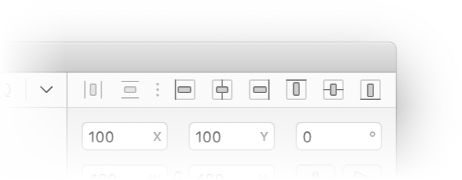
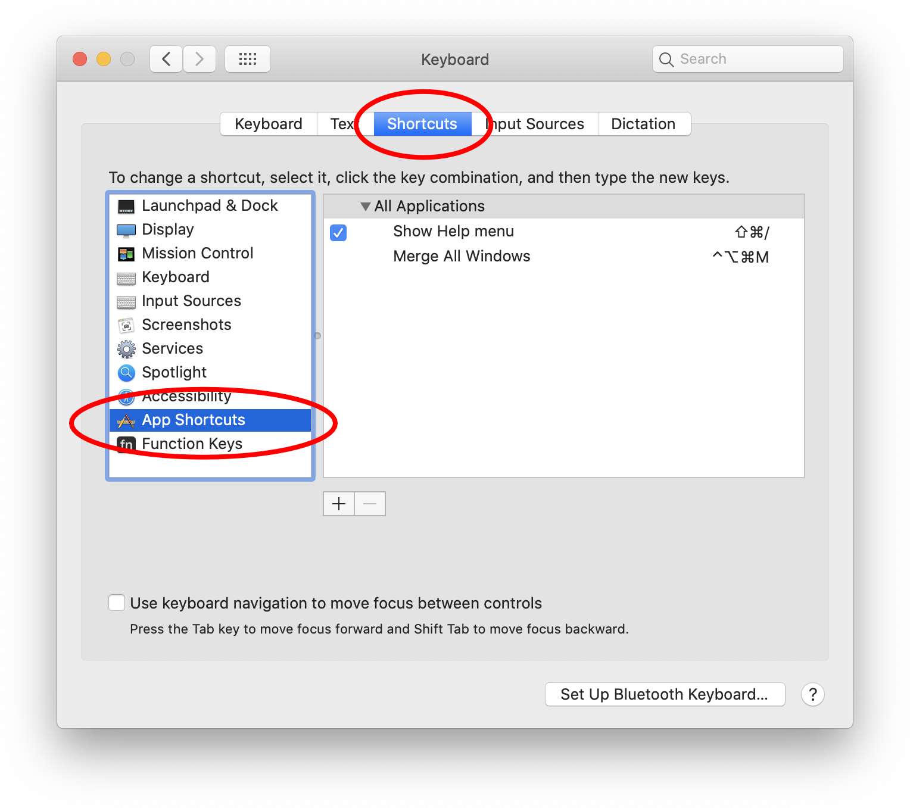
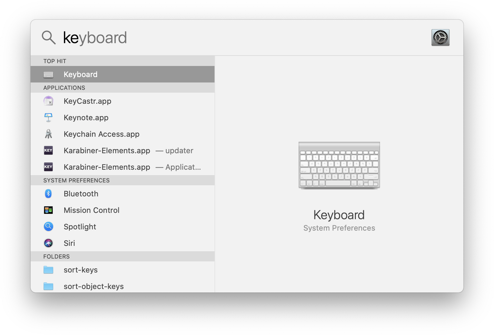
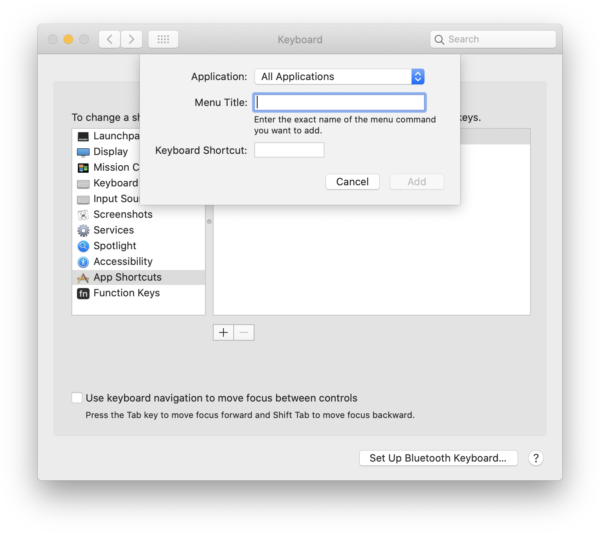
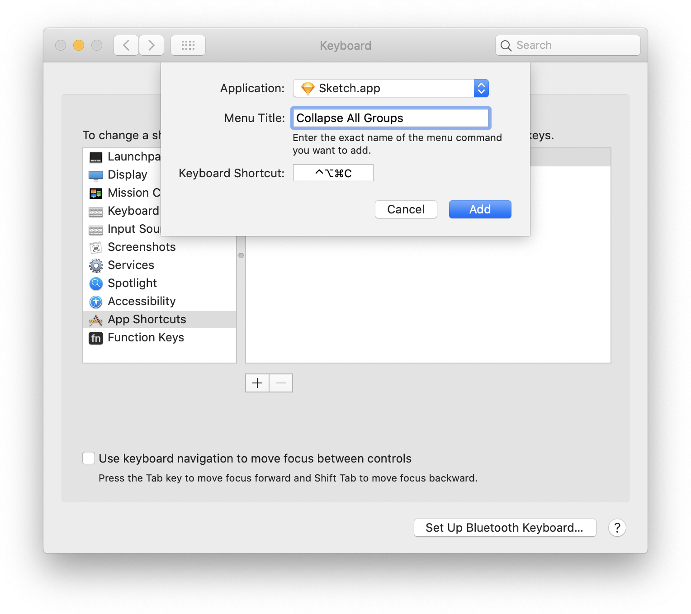

There's a thing you're doing all day long - moving your hands and cursor to control your apps - When you add up all these small movements you'll quickly end up whit a big wasteful repetition. You might have missed it because it's small. You might haven't deal with it because you don't know how - Whatever the reason you've let it slide, it's a wast of your time and **this post is for you!** 

# The painful movement of the hand
Seeing top notch developers working without lifting their hands form the keyboard made me think _is there a way for me to work that way?_ So elegant, so efficient, keeping your hands from a wrist infection. At around 2015 the answer was a **soft no** - I've customized every possible shortcut in _Illustrator_. The nicest thing about Illustrator shortcuts was the ease of creating and managing shortcuts with the `Keyboard Shortcuts` panel _(Fig.Ill)_. but some basic functionalities like resizing a shape wasn't available to begin with, so no shortcut could be assigned.


That same year it looked like *Sketch* was stable enough for production. One of the first things I've noticed that blown my mind when I've stated using it was the ability to resize shapes with stroke of some keys. **Amazing!** It made me feel that this product was build by my kind of people - at least, we share the same OCD. But unfortunately, there there was no easy way to manage keyboard shortcut in *Sketch*. Managing shortcuts on macOS *(fig.keyOS)* ain't a breeze too - beside being cumbersome it's unaware of existing Plugin shortcuts but even worst it doesn't allow you the select nested Plugin commands.

**In this article we'll review 2 ways to rectify the situation.**
- One is by using the macOS's keyboard panel
- The other in by using the plugins `manifest.js`

We'll figure out the Jobs to be done, state the problem, go trough my solutions, cover some edge cases and install a tool that might help a little.  

Hope you guys enjoy it 🙆‍♂️ Let's go!


---
# Jobs to be done

## 1st job

I do a lot aligning when I design, moving my courser to the top right *(fig.align)* all the time is annoying. I'd like to have a shortcut for the Center / Horizontal / Top / Bottom / Left / Right alignment.

 *fig.align*

### The problem

- How do I set a shortcuts for Sketch on macOS? 
- How do I do it for nested commands?

> You ask what are **Nested command?** As we can see an example in *fig.ZZZ* below, where the Alignment options are nested in the *Align* sub-menu.
>
>  *fig.ZZZ*

## 2nd job

Recently I've installed the [Color Contrast Analyser for Sketch](https://github.com/getflourish/Sketch-Color-Contrast-Analyser), which a useful plugin if you'd like to make accessible products without leaving Sketch app for an online solution. The plugin ships without a shortcut and when working on a new design with a lot of contrast checking it can get real annoying real fast. Ad a keyboard fanatics I'd like to set a shortcut for it.

### The problem

How do I set a shortcuts for Sketch *Plugins* when most of them are nested command? 
> Sad fact - macOS Keyboard Shortcut Manager will work **just** for an app's nested command and **not** for its plugins, which are the majority 🤦

## 3rd job 

Some shortcuts are troublesome, let's say the [Comma plugin](https://github.com/margusholland/Comma) - I don't use it that often but it holds a lot of valuable shortcuts out of the box. I'd like to remove them because I might want to use them somewhere else and I also click them by mistake **all** the fricking time 😤

There is one Comma shortcut I'd like to keep while using a different shortcut

### The problem

- How do I delete unwanted plugin shortcuts? 
- How do I edit existing plugin shortcuts? 

---

# The solutions

## 1st solution
### Create your own custom macOS shortcut 

Before we get started please see *(fig.keyOS)* below - it's a screenshot of macOS Keyboard Shortcut Manager. Now let's see how we get it going. BTW - This technique can be used by **all** apps or a **specific** app, not just Sketch 😎

 *fig.keyOS*

1. Open the Keyboard Preferences.

   You can use the *Spotlight Search* with the `control + spacebar` shortcut and start typing `ke...` *(fig.spot)* or just look for it in the System Preferences found in the Apple menu.
   

2. Click the **Shortcut** Tab, like in *(fig.keyOS)*
3. On the left panel, click **App Shortcut**
4. At the bottom of the right panel you'll see `+` and `-` buttons. Clicking the `+` button will open a prompt window (*fig.prompt*)
    *fig.prompt*
5. Pick the app at hand, in our case *Sketch*
6. Type the name of the command you'd like to make a shortcut of. Be mindful - you'll have to type the command name letter to letter as shown in the app's menu, including capital letters and spacing.
  
   Let's start with something simple and useful like `Collapse All Groups` by pasting this string into the *Menu Title* input.
7. Let's type the shortcut into the *Keyboard Shortcut* input. It's usually a modifier key - one of this guys `ctrl` `option` `cmd` `shift` and regular key (every other key that isn't those guys)
   
   For this shortcut i'll use `ctrl` `option` `cmd` + `c` combo - the way to add it is just by clicking them as you would a shortcut while you're in the input.

   It should look like this *(fig.filled prompt)*

    *fig.filled prompt*

8. Click `Add` and there you have it! Your first shortcut for Sketch using macOS's native panel

### Create macOS shortcuts for nested commands

In the Jobs to be jod I've said I want the Alignment commands which are nested. In order to do so we'll repeat the above flow with the next exception: in the *Menu Title* input we'll write the commands full location with this pattern `->` (`dash` + `greater than`) to mark nest descent.
So if we'll add the Top Align command it will look like this: 
```
Arrange->Align->Top 
```
I'll use the `ctrl` + `option` + `cmd` + `shift` + `↑` combo for align *Top*, the `↓` for *Bottom*, the `→` *Right* and, you guessed it, `←` for *Left*. For the *Horizontally* i'll use `h` and `v` for *Vertically*

---

## 2nd solution

Create a custom shortcut using the plugins `manifest.js` file.

### Find the plugin

Firstly let's locate the plugin at hand. The easiest way is by opening the Sketch ***Preferences*** (`⌘`+`,`) and under the ***Plugins*** tab and click the ***Reveal Plugin Folder*** in the contextual menu. Another way is to navigate using the finder, usually to be found in this path ► Library  ► Application Support  ► com.bohemiancoding.sketch3 ► Plugins


### Edit the plugin

Just to make sure where on the right page - plugins are files with the `.sketchplugin` suffix and the file name will be similar or identical to the plugin name. Sweet. Now that you've located the plugin, use the contextual menu to **Show Package Content**. FYY - The plugin is a package, it means that and behind the scenes the plugin is a set of folders and files - some plugins holed many and some just a few. 

Once we're in the package content we'll look for a file called `manifest.js`, usually to be found in ► Contents ► Sketch.  When you locate it open it using a text editor - I'm using VS code but you can use TextEdit or whatever text/code editor you like.

### Edit the `manifest.js` file

Plugins might hold just one command, like this contrast-checker plugin - Some might hold dozens of commands, like the all encompassing [Automate-Sketch](https://github.com/Ashung/Automate-Sketch) plugin. 

Either way we're looking for this pattern → in this example there are 2 commands with no shortcuts. We're looking for  the `name` and `shortcut` key/value pair - The name will be identical to the command as it's presented in the [Plugins select menu](https://www.notion.so/yonatankof/Plugin-shortcuts-for-Sketch-81689b34a9814b4492afb1059e96b638#11a25485adbe49caad3bdf4a011e5891), and the shortcut, well, let's edit it 💪

```json
"commands": [
    {
      "name": "Command Name",
			"identifier": "command_name",
      "handler": "CommandName",
      "script": "Command_Name.js",
      "shortcut": ""
    },
		{
      "name": "Another Command",
      "identifier": "another_command",
			"handler": "AnotherCommand",
      "script": "Another_Command.js",
      "shortcut": ""
    },
  ]
```

We can see that the example and the screenshot aren't identical, its OK, they don't have to be, every developer writes the plugin a bit differently.

I've used the `ctrl` `option` `cmd` `shift` `c` combo to get plugin running, but you can use any modifier key combination you'd like. Save the file and now the shortcut should be available in Sketch

---

## Good to know

### Modifier Keys

Are their name suggest, modifier keys change the normal behavior of a key - It turns `1` into a `!` - Hell yeah! These are the available modifiers - `ctrl` ⌃  `option` ⌥ `cmd` ⌘ `shift` ⇧ - We can use one modifier key or a combination of them. 

### Duplicated shortcuts

Using the same shortcut for more then one action is a pain we have to live with. Unfortunately there's no nice solution that addresses this issue - and [the one that was has been discontinued](https://github.com/exevil/Keys-For-Sketch). My solution is daed simple → use uncommon patterns like `ctrl` `option` `cmd` and when they run out then use `ctrl` `option` `cmd` `shift`. Now clicking so many buttons might be annoying, to get around that I'm using [Karabiner Elements](https://karabiner-elements.pqrs.org/), it enables me to to re-map the `caps lock` as if I'm pressing all the 4 keys together. 

Here's a link to a simple guide to get this hack going by **How-To Geek** - [How to Turn Your Mac’s Caps Lock into an Extra Modifier Key](https://www.howtogeek.com/409904/how-to-turn-your-mac%E2%80%99s-caps-lock-into-an-extra-modifier-key/). Nice hack, thanks internet!

### Updating a plugin

Unfortunately updating a plugin will **reset** your shortcuts :-( As mentioned, there's no proper way to manage shortcuts 😤

### Edit a shortcut

In this article we've added a short cut, bet using this process we edit existing or delete unwanted shortcuts.

Editing is dead simple, just type the desired *value*

```json
"shortcut": "ctrl option l"
```

```json
"shortcut": "shift option l"
```

---

### Remove a shortcut

Deleting a shortcut can be done by removing just the *value,* not minding the *key.*

```json
"name": "God is love",
"identifier": "god_is_love",
"script": "God_Is_Love.js",
"shortcut": ""
```

Or by removing the *key/value pair* altogether

```json
"commands": [
    {
      "name": "God is love",
			"identifier": "god_is_love",
      "script": "God_Is_Love.js"
    },
  ]
```

---

### No shortcut key/value pair?

Conversely, you can add a shortcut *key/value pair* if none exist, like in the case of the [Automate-Sketch](https://github.com/Ashung/Automate-Sketch) plugin.

> Mind the position of the `,` so you won't mess things up. The logic is simple - don't place a *comma* at the end of a curly bracket.

---

## Take aways

1. **Save time**

    Using a shortcuts might save a few second here and there instead of using the mouse or trackpad when reaching to a command in the UI. The deal is - when working  full time, all day long it might save you minutes a day and up to few hours a month.

2. **Better workflows**

    These commands are additional tools in our box, and tools we use shape the way we think.

3. **Take control** 

    Our brain is plastic and it bends in certain way - When we use our memory to trigger a command instead of lookin for it in the UI we improve our chances to form a clearer path to the command and us using it. We're bound to the way we do things


---

# Unused

Doing the same small-but-slow (`🐜`) thing over and over again leads up to a big-and-slower thing. You might have missed it because it's small. You might haven't deal with it because you don't know how - what ever the reason it's a wast of your time and **this post is for you!** 

You might have missed it because it's small. You might haven't deal with it because you don't know how - But when adding small things you end up with a big one. I'm talking about what you do all day long - moving your hands and curser to control your apps. Whatever the reason you've let it slide, it's a wast of your time and **this post is for you!** 